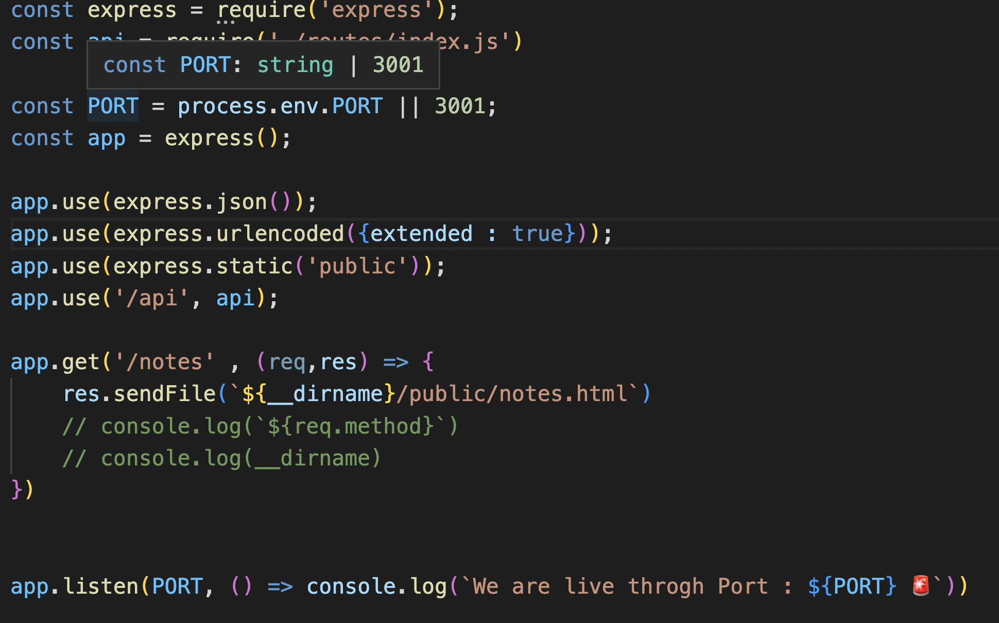
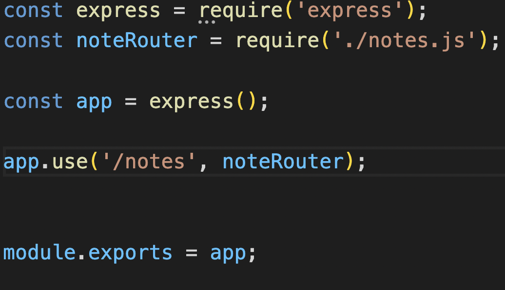
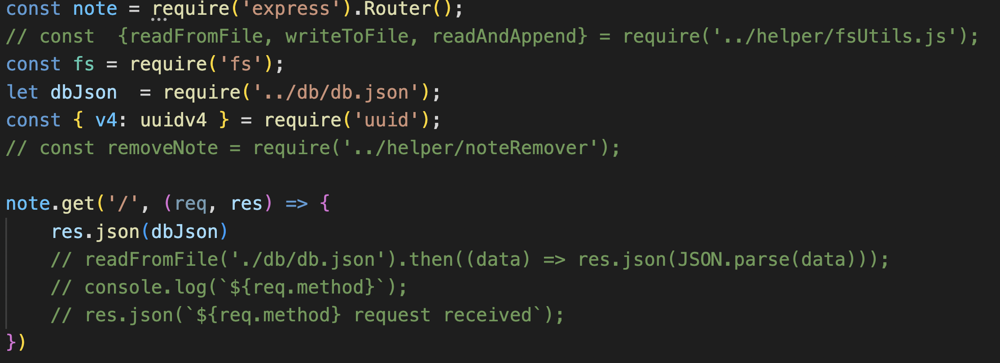
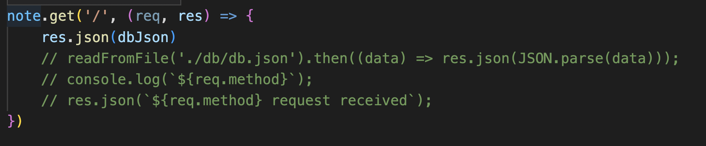
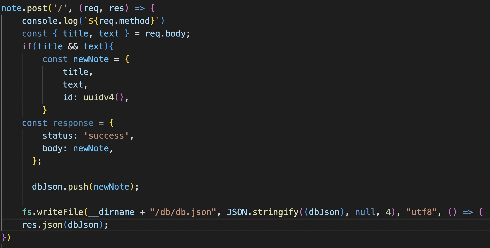
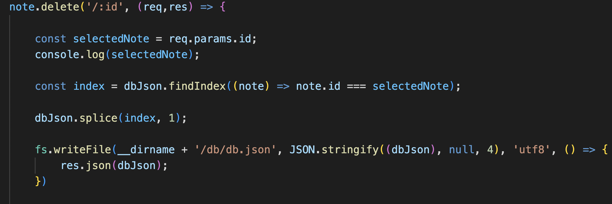

# Nothing but Notes 
   

  ## Description
  This application was designed to jot down notes and save them through a server. It gives you the ability to take down some note on your phone and later see them in a different device. Simply write a note and safe it, or delete a note you don't have a need for.

  ## Table of Contents 
  - [Installation](#installation)
  - [Usage](#usage)
  - [Credits](#credits)

  ## Installation
  There is no need to install any program. We have partnered up with Heroku. Here is to link to use in any web browser: https://nothing-but-notes.herokuapp.com/

  ## Usage
  When you have arrived at the webpage click the button that will transfer you to the note page. Once there fill in a title for you note and write down what you want to note. Click the notes on the left and they will repear in the right. Make sure you dont forget to save a note before doing anthing else.  

  ## Credits
  This app was made almost all possibly by myself. I did need to check in with some of my friends to make sure the delete worked and everything did work out in the end. 

  ## Questions
  Here is my email for questions:  jimmysolis14@gmail.com
   
  If you would like to look me up in github, here is my username: JimmySolis
   
  Follow these instructions to contact me:  
  Please email me with any questions. I will respond in 24 hours.

 

 # How was it done?

 ### 1: Here I have made my server and added the needed express properties to make my app work.
 

 ### 2: I then have to make sure I have a page that contains all of my routes and export them.
 
 
 ### 3: Then make a page that contains the api routes needed to connect my front end to the back.
 

 ### 4: After that I add a GET.
 

 ### 5: Next, I add a POST.
 

 ### 6: Finally I add a DELETE.
 

 #### "With all of this I am able to connect with the javascript that holds the event listeners and functions dedicated to dynamically change my app." 
 
 #### Here are the links to the GitHub repo and Herko deployed app:
 ##### https://github.com/JimmySolis/nothingButNotes
 ##### https://nothing-but-notes.herokuapp.com/